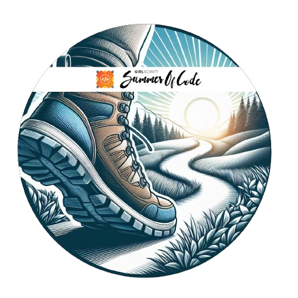

<h1>Hey there, Siddheya this side!</h1>

 

### 💫 About Me

- 💼 I'm a Software Engineer
- 🔭 I’m currently working on Backend Development
- 🌱 I’m currently learning DevOps
- 👯 I’m looking to collaborate with open source enthusiasts
- 🥅 2025 Goals: Learn DevOps, Nextjs And strengthen DSA

 

## 🌐 Socials:

 

## 💻 Tech Stack:

 

## 📊 GitHub Stats:

 

## 🚀 Open Source Contributions 

  
| S.No. | Repository | Type | Link |
|-------------|-------------|--------------|------------|
| 1 | [awesome-github-profiles](https://github.com/recodehive/awesome-github-profiles/) | PR (Merged) | [#285](https://github.com/recodehive/awesome-github-profiles/pull/285) |
| 2 | [awesome-github-profiles](https://github.com/recodehive/awesome-github-profiles/) | PR (Merged) | [#261](https://github.com/recodehive/awesome-github-profiles/pull/261) |
| 3 | [awesome-github-profiles](https://github.com/recodehive/awesome-github-profiles/) | PR (Merged) | [#97](https://github.com/recodehive/awesome-github-profiles/pull/97) |
| 4 | [HelpOps-Hub](https://github.com/mdazfar2/HelpOps-Hub/) | PR (Merged) | [#1160](https://github.com/mdazfar2/HelpOps-Hub/pull/1160) |
| 5 | [Community-Site](https://github.com/Its-Aman-Yadav/Community-Site/) | PR (Merged) | [#1138](https://github.com/Its-Aman-Yadav/Community-Site/pull/1138) |
| 6 | [Community-Site](https://github.com/Its-Aman-Yadav/Community-Site/) | PR (Merged) | [#1074](https://github.com/Its-Aman-Yadav/Community-Site/pull/1074) |
| 7 | [HelpOps-Hub](https://github.com/mdazfar2/HelpOps-Hub/) | PR (Merged) | [#1026](https://github.com/mdazfar2/HelpOps-Hub/pull/1026) |
| 8 | [RefactorMate](https://github.com/harmeetsingh11/RefactorMate/) | PR (Merged) | [#104](https://github.com/harmeetsingh11/RefactorMate/pull/104) |
| 9 | [RefactorMate](https://github.com/harmeetsingh11/RefactorMate/) | PR (Merged) | [#102](https://github.com/harmeetsingh11/RefactorMate/pull/102) |
| 10 | [chanakya-niti](https://github.com/Avdhesh-Varshney/chanakya-niti/) | PR (Merged) | [#197](https://github.com/Avdhesh-Varshney/chanakya-niti/pull/197) |
| 11 | [HelpOps-Hub](https://github.com/mdazfar2/HelpOps-Hub/) | PR (Merged) | [#853](https://github.com/mdazfar2/HelpOps-Hub/pull/853) |
| 12 | [Counsellor-Web](https://github.com/Counselllor/Counsellor-Web/) | PR (Merged) | [#853](https://github.com/Counselllor/Counsellor-Web/pull/853) |
| 13 | [HelpOps-Hub](https://github.com/mdazfar2/HelpOps-Hub/) | PR (Merged) | [#736](https://github.com/mdazfar2/HelpOps-Hub/pull/736) |
| 14 | [chanakya-niti](https://github.com/Avdhesh-Varshney/chanakya-niti/) | PR (Merged) | [#162](https://github.com/Avdhesh-Varshney/chanakya-niti/pull/162) |
| 15 | [HelpOps-Hub](https://github.com/mdazfar2/HelpOps-Hub/) | PR (Merged) | [#706](https://github.com/mdazfar2/HelpOps-Hub/pull/706) |
| 16 | [HelpOps-Hub](https://github.com/mdazfar2/HelpOps-Hub/) | PR (Merged) | [#702](https://github.com/mdazfar2/HelpOps-Hub/pull/702) |
| 17 | [HelpOps-Hub](https://github.com/mdazfar2/HelpOps-Hub/) | PR (Merged) | [#680](https://github.com/mdazfar2/HelpOps-Hub/pull/680) |
| 18 | [HelpOps-Hub](https://github.com/mdazfar2/HelpOps-Hub/) | PR (Merged) | [#666](https://github.com/mdazfar2/HelpOps-Hub/pull/666) |
| 19 | [HelpOps-Hub](https://github.com/mdazfar2/HelpOps-Hub/) | PR (Merged) | [#655](https://github.com/mdazfar2/HelpOps-Hub/pull/655) |
| 20 | [click-metrics](https://github.com/oxiton-foundation/click-metrics/) | PR (Merged) | [#188](https://github.com/oxiton-foundation/click-metrics/pull/188) |
| 21 | [HelpOps-Hub](https://github.com/mdazfar2/HelpOps-Hub/) | PR (Merged) | [#519](https://github.com/mdazfar2/HelpOps-Hub/pull/519) |
| 22 | [HelpOps-Hub](https://github.com/mdazfar2/HelpOps-Hub/) | PR (Merged) | [#468](https://github.com/mdazfar2/HelpOps-Hub/pull/468) |
| 23 | [HelpOps-Hub](https://github.com/mdazfar2/HelpOps-Hub/) | PR (Merged) | [#463](https://github.com/mdazfar2/HelpOps-Hub/pull/463) |
| 24 | [popShop](https://github.com/Sayak-Bhunia/mystory/) | PR (Merged) | [#242](https://github.com/pooranjoyb/popShop/pull/242) |
| 25 | [ReactChat](https://github.com/urstrulynishkarsh/ReactChat/) | PR (Merged) | [#185](https://github.com/urstrulynishkarsh/ReactChat/pull/185) |
| 26 | [mystory](https://github.com/Sayak-Bhunia/mystory/) | PR (Merged) | [#240](https://github.com/Sayak-Bhunia/mystory/pull/240/) |
| 27 | [Stackoverflow-Analysis](https://github.com/recodehive/Stackoverflow-Analysis) | PR (Merged) | [#128](https://github.com/recodehive/Stackoverflow-Analysis/pull/128) |

# 🏆 Trophies

# 🎖 Badges

<b> GSSoC'24 Badges </b>

<a href="https://gssoc.girlscript.tech/leaderboard">

  
  
  
  
  
  
  

 

  
<b> HoloPin Badges </b>

  

 

  <b>Thanks for your visit to my profile! If you appreciate my work, consider buying me a coffee. 😊</b>

  

